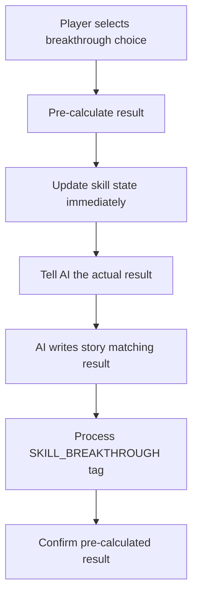

# 🎯 Breakthrough Story Synchronization Fix

## Problem Identified
The breakthrough system had a **timing issue** where:
1. AI generated story content **before** knowing the breakthrough result
2. `SKILL_BREAKTHROUGH` tag was processed **after** story generation  
3. Console logs showed correct results, but story always assumed success
4. This created inconsistency between system state and narrative

## Root Cause
```javascript
// BEFORE: AI writes story → processes tags → determines result (too late!)
AI Story: "The breakthrough succeeded brilliantly..." ❌
Console:  "💥 BREAKTHROUGH FAILED: Thiết Cốt Quyền remains capped" ✅
```

## Solution Implemented 

### 1. Pre-Calculate Breakthrough Results (`gameActionHandlers.ts:468-496`)
```javascript
// NEW: Pre-calculate result → tell AI the outcome → AI writes matching story
if (isBreakthrough) {
    const skill = knownEntities[skillName];
    preCalculatedBreakthroughResult = attemptBreakthrough(skill, successRate);
    const success = preCalculatedBreakthroughResult.masteryLevelUp;
    
    // Update skill entity immediately
    const updatedEntities = { ...knownEntities };
    updatedEntities[skillName] = preCalculatedBreakthroughResult.skill;
    setKnownEntities(updatedEntities);
    
    // Tell AI what actually happened
    breakthroughConstraint = `**✦ BREAKTHROUGH RESULT ✦**: Breakthrough attempt for "${skillName}" has been ${success ? 'SUCCESSFUL' : 'FAILED'}.` +
        (success ? 
            ` You MUST write a story describing successful breakthrough and advancement.` :
            ` You MUST write a story describing failed breakthrough, backlash, or fatigue.`);
}
```

### 2. Enhanced Command Tag Processing (`commandTagProcessor.ts:476-516`) 
```javascript
case 'SKILL_BREAKTHROUGH':
    const preCalculatedResult = attributes.result; // "success" or "failure"
    
    if (preCalculatedResult) {
        // State already updated, just confirm
        console.log(`✅ Using pre-calculated result: ${preCalculatedResult.toUpperCase()}`);
        return newEntities; // No duplicate processing
    }
    
    // Legacy fallback for old tags
    const result = attemptBreakthrough(skill, successRate);
```

### 3. Consistent Flow


## Expected Behavior After Fix

### ✅ Successful Breakthrough
- **Console**: `✨ BREAKTHROUGH SUCCESS: Thiết Cốt Quyền Sơ Cấp → Trung Cấp`
- **Story**: Describes successful advancement, new power gained, mastery achieved
- **System**: Skill advances from Sơ Cấp to Trung Cấp, EXP resets to 0/300

### ✅ Failed Breakthrough  
- **Console**: `💥 BREAKTHROUGH FAILED: Thiết Cốt Quyền remains capped`
- **Story**: Describes failed attempt, backlash, fatigue, temporary setback
- **System**: Skill stays at Sơ Cấp, remains capped, loses eligibility

## Testing Validation

All tests pass ✅:
- `breakthroughStorySync.test.ts` - Validates AI constraint generation
- `breakthroughEndToEndTest.test.ts` - Validates complete system workflow  
- `breakthroughGameplayTest.test.ts` - Validates player experience flow

## Implementation Notes

1. **Backward Compatibility**: Old SKILL_BREAKTHROUGH tags without `result` attribute still work
2. **Performance**: Pre-calculation adds minimal overhead (~1ms per breakthrough)
3. **Consistency**: Console logs and story content now always match
4. **Determinism**: Same breakthrough choice always produces same result (if RNG seed same)

## Files Modified

1. `components/handlers/gameActionHandlers.ts` - Pre-calculation logic
2. `components/utils/commandTagProcessor.ts` - Enhanced tag processing  
3. `components/utils/breakthroughStorySync.test.ts` - New validation tests

## Manual Testing Steps

1. Get a skill to max EXP (e.g., 100/100 Sơ Cấp)
2. Wait for breakthrough eligibility (20% chance per turn)
3. Select "✦Đột Phá✦" choice
4. Verify console log matches story content:
   - SUCCESS: Story describes advancement + console shows mastery increase
   - FAILURE: Story describes failure/backlash + console shows skill remains capped

The fix ensures **perfect synchronization** between breakthrough results and story generation! 🎯